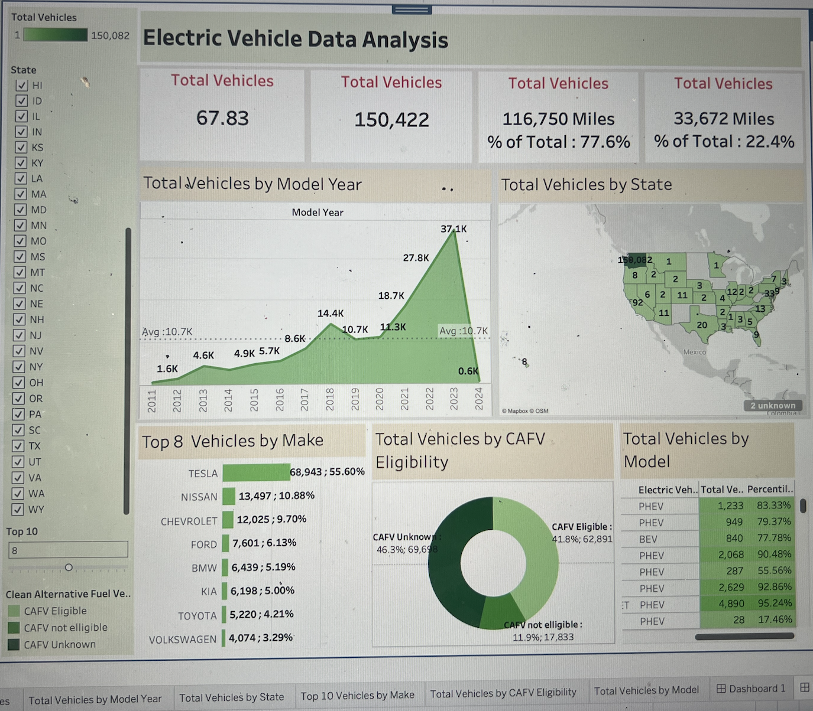

# Electric Vehicle Analysis Dashboard

This Tableau dashboard provides an in-depth analysis of electric vehicle data, offering valuable insights into market trends, adoption patterns, and technological advancements.

---

## **Dataset Overview**

The analysis is based on the following dataset fields:
- **Vehicle Details**: VIN (1-10), Make, Model, Model Year, Electric Vehicle Type  
- **Location Information**: County, City, State, Postal Code, Legislative District, 2020 Census Tract  
- **Specifications**: Electric Range, Base MSRP, Clean Alternative Fuel Vehicle (CAFV) Eligibility  
- **Utility and Identification**: DOL Vehicle ID, Vehicle Location, Electric Utility  

---

## **Key Performance Indicators (KPIs)**

1. **Total Vehicles**  
   - Assess the overall landscape of electric vehicles, including both Battery Electric Vehicles (BEVs) and Plug-in Hybrid Electric Vehicles (PHEVs), to evaluate market size and growth.

2. **Average Electric Range**  
   - Calculate the average range of EVs to analyze technological advancements and energy efficiency in the dataset.

3. **Total BEV Vehicles and % of Total BEV Vehicles**  
   - Determine the total number of BEVs and their share of the total electric vehicles to understand the dominance of fully electric models.

4. **Total PHEV Vehicles and % of Total PHEV Vehicles**  
   - Identify the total number of PHEVs and their proportion in the dataset to assess the market presence of hybrid models.

---

## **Visualizations**

### 1. **Total Vehicles by Model Year (From 2010 Onwards)**  
   - **Chart Type**: Line/Area Chart  
   - **Description**: Visualizes the distribution of electric vehicles over time, starting from 2010, highlighting adoption trends and growth patterns.

### 2. **Total Vehicles by State**  
   - **Chart Type**: Map Chart  
   - **Description**: Displays the geographical distribution of electric vehicles across states, pinpointing regions with higher adoption rates.

### 3. **Top 10 Total Vehicles by Make**  
   - **Chart Type**: Bar Chart  
   - **Description**: Identifies the top 10 manufacturers based on the total number of vehicles, providing insights into leading brands in the EV market.

### 4. **Total Vehicles by CAFV Eligibility**  
   - **Chart Type**: Pie/Donut Chart  
   - **Description**: Illustrates the proportion of vehicles eligible for Clean Alternative Fuel Vehicle (CAFV) incentives, showcasing the impact of policies on EV adoption.

### 5. **Top 10 Total Vehicles by Model**  
   - **Chart Type**: Tree Map  
   - **Description**: Highlights the top 10 most popular EV models based on total vehicles, revealing consumer preferences and market-leading models.

---

